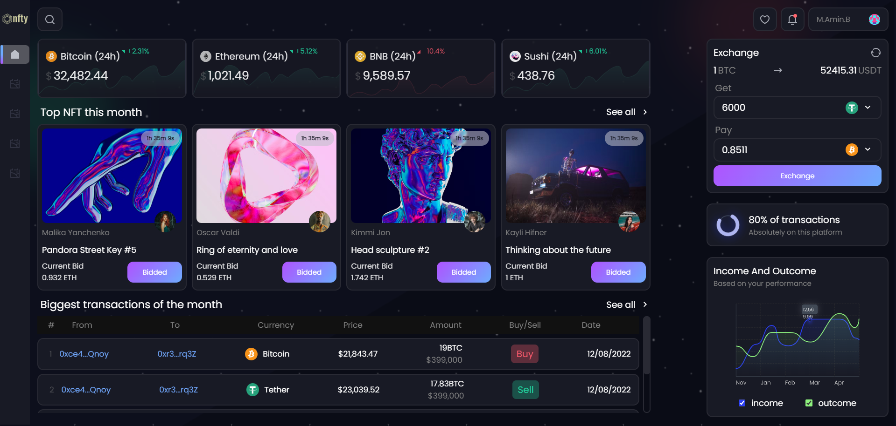

<div align="center">

# NFTY (Panel)

<!-- latest version -->
**Version 1.0.0**

<!-- overView -->
</br>

</div>

<!-- technology badge -->


[](#✅-license)

## ✍ description

<p>
This project is a static NFT panel designed with html, css and js.

To style the page, I have used the Grid module and the Flex module, which is CSS modules.
</p>

<details open>
<summary><h2> 📋 Table of Contents </h2></summary>

- [Description](#✍-description)

- [Table of Contents](#📋-table-of-contents)

- [Demo](#👀-demo)

- [Development](#👨‍💻-development)

  - [What's included](#What's-included)

- [Version logs](#📑-version-logs)

- [Installation](#⚙-installation)

- [Usage](#🔧-usage)

- [Contribute](#🤝-contributing)

- [Questions](#❓-questions)

- [Author](#😎-author)

- [License](#✅-license)

</details>

## 👀 Demo

[Live Preview](https://m-amin-b.github.io/nfty-panel/)

## 👨‍💻 Development

### What's included

Within the download file you'll find the following directories and files:

```
nfty-panel/
├── assets/
|   ├── css/
|   |   └── style.css
|   ├── font/
|   |   └── Poppins-Regular.ttf
|   ├── images/
|   |   └── ...
|   └── js/
|       └── script.js
|
└── index.html
```

## 📑 Version logs

**V1.0.0** - 15 May 2024 - Original Release

- Responsive

## ⚙ Installation

You can Install this project to your PC using clone the repo to your github account or Download ZIP File.

- [Download from Github](https://github.com/m-amin-b/nfty-panel/archive/refs/heads/main.zip)
- ```
  git clone https://github.com/m-amin-b/nfty-panel.git
  ```

## 🔧 Usage

After The Installation you can now use the project files by UnZip the file and open it on any Code Text Editor (VS Code).

## 🤝 Contributing

Open an **_issue_** or a **_pull request_** to suggest changes or additions.

## ❓ Questions

[Open an Issue](https://github.com/m-amin-b/nfty-panel/issues/new/) and let's chat!

## 😎 Author

[M-AMIN-B](https://github.com/m-amin-b)

## ✅ License
 
[MIT License](https://github.com/m-amin-b/nfty-panel/blob/main/LICENSE)
